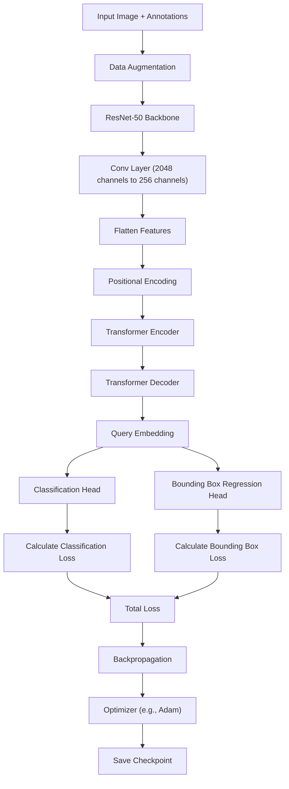

# 🚀DETR on Custom Dataset with Roboflow

## 📖Deskripsi
Proyek ini mengimplementasikan DETR (DEtection TRansformer) untuk deteksi objek menggunakan dataset COCO dari Roboflow. DETR adalah pendekatan modern untuk deteksi objek yang memanfaatkan Transformers.

## 🤖Roboflow
Import Roboflow version menjadi **coco JSON** kemudian download filenya dan extract kedalam folder kerja `dataset/`

## 📂Struktur Folder
- `config/`: Berisi file konfigurasi.
- `data/`: Kode untuk DataLoader dan kelas dataset.
- `dataset/`: Berisi dataset yang telah di ekstrasi
- `models/`: Definisi model DETR.
- `training/`: Script untuk pelatihan dan evaluasi model.
- `utils/`: Fungsi bantuan untuk anotasi dan visualisasi (opsional).
- `scripts/`: Script untuk menyiapkan lingkungan.
- `main.py`: Skrip utama untuk menjalankan pelatihan, evaluasi, atau inferensi.
- `requirements.txt`: Daftar dependensi proyek.

## 🧠 Arsitektur Model DETR

Model DETR yang digunakan dalam proyek ini terdiri dari beberapa komponen utama:

1. **Backbone (ResNet-50)**: 
   - Digunakan untuk mengekstrak fitur dari gambar input.
   - Layer terakhir (`layer4`) dari ResNet dihapus untuk mempertahankan fitur spatial.
   
2. **Positional Encoding**:
   - Menambahkan informasi posisi pada fitur yang dihasilkan oleh backbone.
   - Menggunakan **sinusoidal positional encoding**.

3. **Transformer Encoder-Decoder**:
   - **Encoder**: Memproses fitur yang diberikan oleh backbone bersama dengan positional encoding.
   - **Decoder**: Menerima query embedding untuk memprediksi bounding box dan label kelas.

4. **Detection Heads**:
   - **Classification Head**: Untuk memprediksi label kelas.
   - **Bounding Box Regression Head**: Untuk memprediksi koordinat bounding box.

### ⚛️Struktur Model
Berikut adalah penjelasan mengenai struktur model yang diimplementasikan:

```plaintext
DETRModel(
  (backbone): Sequential(
    (0): Conv2d(3, 64, kernel_size=(7, 7), stride=(2, 2), padding=(3, 3), bias=False)
    (1): BatchNorm2d(64, eps=1e-05, momentum=0.1, affine=True, track_running_stats=True)
    (2): ReLU(inplace=True)
    (3): MaxPool2d(kernel_size=3, stride=2, padding=1, dilation=1, ceil_mode=False)
    (4-7): Sequential Layers (ResNet-50)
  )
  (conv): Conv2d(2048, 256, kernel_size=(1, 1), stride=(1, 1))
  (pos_encoder): PositionalEncoding(
    (pe): Tensor of shape [5000, 256]
  )
  (transformer): Transformer(
    (encoder): TransformerEncoder with 6 layers
    (decoder): TransformerDecoder with 6 layers
  )
  (query_embed): Embedding(100, 256)
  (class_embed): Linear(in_features=256, out_features=num_classes + 1)
  (bbox_embed): Linear(in_features=256, out_features=4)
)
```

## 🔍 Detail Komponen
- Backbone (ResNet-50): Menyediakan fitur awal dari gambar input dengan resolusi yang diperkecil.
- Positional Encoding: Menambahkan informasi posisi ke fitur backbone.
- Transformer Encoder-Decoder: Memproses fitur backbone dan query embedding untuk menghasilkan prediksi.
- Detection Heads:
  - Class Embed: Memperkirakan label dari objek.
  - Bounding Box Embed: Memperkirakan koordinat bounding box.

## 👾Instalasi
### Langkah-langkah:
1. Clone repositori ini:
git clone https://github.com/HulwanulAzkaP/detr_customdataset

    ```cd detr_customdataset```

2. Buat virtual environment (Opsional):
```
python -m venv .venv
source .venv/bin/activate  # Linux/Mac
.venv\Scripts\activate     # Windows
```

3. Instal dependensi:
```pip install -r requirements.txt``` atau ```python scripts/setup_environtments.py```

## 🖥️Penggunaan
### 1. Menyiapkan Dataset
Pastikan dataset berada di folder `dataset/` dengan struktur berikut:
```
dataset/
├── train/
│   ├── images/
│   └── _annotations.coco.json
├── valid/
│   ├── images/
│   └── _annotations.coco.json
└── test/
    ├── images/
    └── _annotations.coco.json
```
### 2. Menjalankan Skrip
- Untuk melatih model:

    ```python main.py```

### 3. Konfigurasi
Edit file `config/config.py` untuk menyesuaikan pengaturan seperti `num_epochs`, `batch_size`, `learning_rate`. `Threshold`, `Dan lain sebagainya`

## Contoh Hasil
Setelah pelatihan dan evaluasi, hasil metrik akan ditampilkan:
```
Epoch 20, 
Training Loss: 0.5846
Evaluating on test set...
Precision: 0.85
Recall: 0.80
F1-Score: 0.82
```
## 🎓Tujuan
Project ini kami susun guna menyelesaikan **Tugas Akhir** S1 Sains Data di **Telkom University Purwokerto** dengan judul _"Deteksi Citra Kebakaran Hutan Menggunakan Metode Deteksi Objek DETR"_

## Lisensi
Proyek ini dilisensikan di bawah lisensi MIT.

